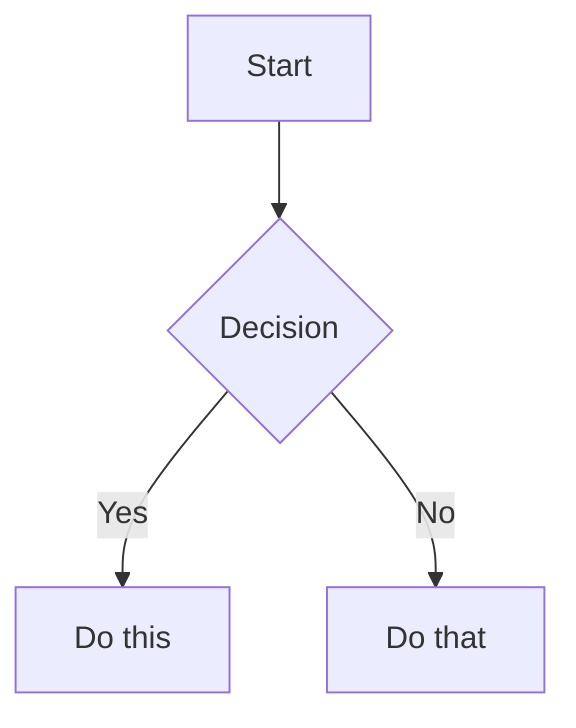

# Markdown Editor

A modern, feature-rich markdown editor with live preview, built with Nuxt 3 and Vue 3. Experience real-time rendering, syntax highlighting, and seamless editing in a beautiful, responsive interface.


## ✨ Features

### 🚀 Core Features
- **Live Preview** - See your markdown rendered in real-time as you type
- **Syntax Highlighting** - Beautiful code blocks with language-specific highlighting
- **Dark Mode** - Easy on the eyes with automatic theme detection
- **Auto-Save** - Never lose your work with intelligent auto-saving
- **PWA Support** - Install as a desktop app or use offline

### 📝 Markdown Features
- **Extended Markdown** - Tables, footnotes, task lists, and more
- **Math Support** - LaTeX math rendering with KaTeX
- **Mermaid Diagrams** - Create flowcharts and diagrams with text
- **PlantUML Support** - UML diagrams from simple text descriptions
- **Table of Contents** - Auto-generated navigation for your documents
- **Smart Copy** - One-click code block copying

### 💻 Editor Features
- **Scroll Sync** - Synchronized scrolling between editor and preview
- **Word Wrap** - Toggle word wrapping for long lines
- **Focus Mode** - Distraction-free writing experience
- **Resizable Panels** - Drag to resize editor and preview panes
- **Mobile Responsive** - Optimized for all devices
- **Export Options** - Download as Markdown, HTML, or plain text

## 🚀 Getting Started

### Prerequisites
- Node.js 18+ or Bun
- Git

### Installation

```bash
# Clone the repository
git clone https://github.com/LeonKohli/md-viewer.git
cd md-viewer

# Install dependencies (using bun)
bun install

# Start development server
bun run dev
```

The app will be available at `http://localhost:3000`

### Available Scripts

```bash
bun run dev          # Start development server
bun run build        # Build for production
bun run preview      # Preview production build
bun run typecheck    # Run TypeScript type checking
```

## 🎯 Usage

### Keyboard Shortcuts

| Shortcut | Action |
|----------|--------|
| `Ctrl/Cmd + S` | Manual save |
| `Ctrl/Cmd + Shift + K` | Clear editor |
| `Ctrl/Cmd + /` | Toggle table of contents |
| `ESC` | Exit fullscreen |

### Markdown Examples

The editor supports all standard markdown plus:

````markdown
# Headers with Table of Contents

## Math Equations
Inline math: $E = mc^2$

Block math:
$$
\sum_{i=1}^{n} x_i = x_1 + x_2 + ... + x_n
$$

## Task Lists
- [x] Completed task
- [ ] Pending task

## Mermaid Diagrams

````


## 📁 Project Structure

```
md-viewer/
├── app/
│   ├── components/      # Vue components
│   │   ├── ui/         # shadcn-vue UI components
│   │   └── ...         # Feature components
│   ├── composables/    # Reusable logic
│   ├── pages/          # Application pages
│   ├── plugins/        # Nuxt plugins
│   └── assets/         # CSS and static assets
├── public/             # Static files
├── server/             # Server API routes
└── nuxt.config.ts      # Nuxt configuration
```

## 🤝 Contributing

Contributions are welcome! Please feel free to submit a Pull Request. For major changes, please open an issue first to discuss what you would like to change.

1. Fork the repository
2. Create your feature branch (`git checkout -b feature/AmazingFeature`)
3. Commit your changes using semantic commits (`git commit -m 'feat: add amazing feature'`)
4. Push to the branch (`git push origin feature/AmazingFeature`)
5. Open a Pull Request


## 📄 License

This project is licensed under the MIT License - see the [LICENSE](LICENSE) file for details.

## 🙏 Acknowledgments

- Built with [Nuxt 3](https://nuxt.com/)
- UI components from [shadcn-vue](https://www.shadcn-vue.com/)
- Markdown processing by [markdown-it](https://github.com/markdown-it/markdown-it)
- Math rendering by [KaTeX](https://katex.org/)
- Diagram support by [Mermaid](https://mermaid-js.github.io/)

---

<p align="center">Made with ❤️ by <a href="https://github.com/LeonKohli">Leon Kohli</a></p>